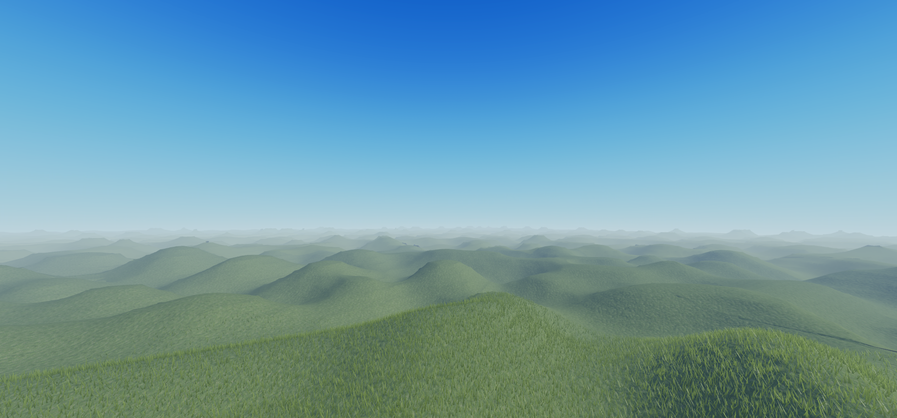

# Generating Terrain

In this tutorial, we will set up a simple procedural terrain generator using Perlin noise. We will start by implementing it in a single thread, and then parallelize it later.

Note that as procedural terrain generation is not the primary focus of this tutorial, we will keep the implementation simple and focus on the threading aspects, and explanations of the terrain generation algorithm will be minimal.
The purpose of this article is to set up a simple example of a task that can be parallelized using Resync.

## The terrain generator

We will use Luau's built-in `math.noise` function as our noise generator. To make parallelizing our terrain generation easier later, we will create a ModuleScript that returns a function that generates a single chunk of terrain.
Let's call the ModuleScript `ChunkGenerator` and place it in `ServerScriptService`.

```luau linenums="1"
-- ServerScriptService.ChunkGenerator
--!native

-- Create an N-dimensional table where each dimension has a length of size.
-- Initialize all elements in the table with elemValue.
function makeNdArray(numDim, size, elemValue)
    if numDim == 0 then
        return elemValue
    end
    local result = {}
    for i = 1, size do
        result[i] = makeNdArray(numDim - 1, size, elemValue)
    end
    return result
end

-- Generate a chunk at the given chunk position (chunk position = absolute position / chunk size)
return function(x: number, z: number, chunkSize: number, noiseScale: number)
    -- Calculate the position of the -x,-z corner of the chunk
    local absoluteX = x * chunkSize * 4
    local absoluteZ = z * chunkSize * 4
    
    -- Loop through all points in the chunk and calculate the height value
    local materials = makeNdArray(3, chunkSize, Enum.Material.Grass)
    local occupancy = makeNdArray(3, chunkSize, 0)
    
    for x = 0, chunkSize - 1 do
        for z = 0, chunkSize - 1 do
            local noiseX = (absoluteX + x * 4) / noiseScale
            local noiseZ = (absoluteZ + z * 4) / noiseScale
            
            -- Set the base height to 10 and add a random amount to it with math.noise
            local noise = math.noise(noiseX, noiseZ) * 10
            local height = noise + 10
            
            for y = 0, chunkSize - 1 do
                local xIndex = x + 1
                local yIndex = y + 1
                local zIndex = z + 1
                
                -- Set the occupancy at the current point
                occupancy[xIndex][yIndex][zIndex] = math.clamp(height - y, 0, 1)
            end
        end
    end
    
    -- Set up the region for the chunk
    local region = Region3.new(
        Vector3.new(absoluteX, 0, absoluteZ),
        Vector3.new(absoluteX + chunkSize * 4, chunkSize * 4, absoluteZ + chunkSize * 4)
    )
    
    -- Write the voxels
    workspace.Terrain:WriteVoxels(region, 4, materials, occupancy)
end
```

Next we'll set up a simple script that generates a region of terrain using the `TerrainGenerator` module.

```luau linenums="1"
local ServerScriptService = game:GetService("ServerScriptService")
local ChunkGenerator = require(ServerScriptService.ChunkGenerator)

local areaSize = 32     -- The size of the area to generate in chunks
local chunkSize = 32    -- The size of each chunk in voxels (4 studs per voxel)

local startTime = os.clock()
for x = -areaSize // 2, areaSize // 2 do
    for z = -areaSize // 2, areaSize // 2 do
        ChunkGenerator(x, z, chunkSize, 100)
    end
end
local endTime = os.clock()

local timeTaken = endTime - startTime
print("Serial execution time:", timeTaken)
```

## Results

When you run the script, you should see the terrain appear after a few seconds. The script will print the time taken to generate the terrain in a single thread.


