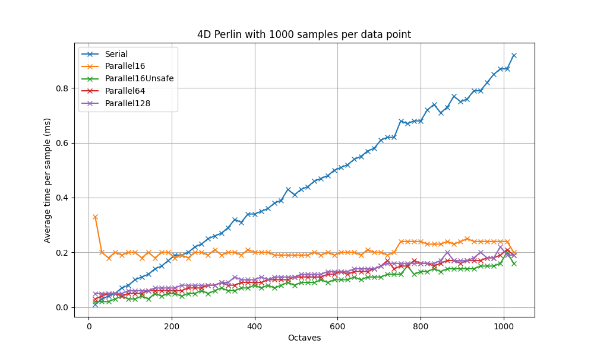

# About Resync

Resync is an open-source library that provides a synchronous API for performing parallel tasks with parallel Luau.

!!! warning "Disclaimer"
    Not all tasks benefit from parallelism. In some cases, parallelizing tasks can actually slow down your code due to the overhead of creating and managing threads. It is important to profile your code and determine if parallelism is the right solution for your problem.

!!! info
    Basic understanding of parallel Luau is assumed in this documentation. If you are new to parallel Luau, it is recommended to read the [official Roblox documentation](https://create.roblox.com/docs/scripting/multithreading).

## Benchmarks

*Average sampling times over 1000 iterations for 4D Perlin noise generation with varying thread and noise octave counts. Samples with more octaves require more iterations of the Perlin noise function for a single sample. Unsafe benchmarks have Resync's thread synchronization mechanism disabled.*
